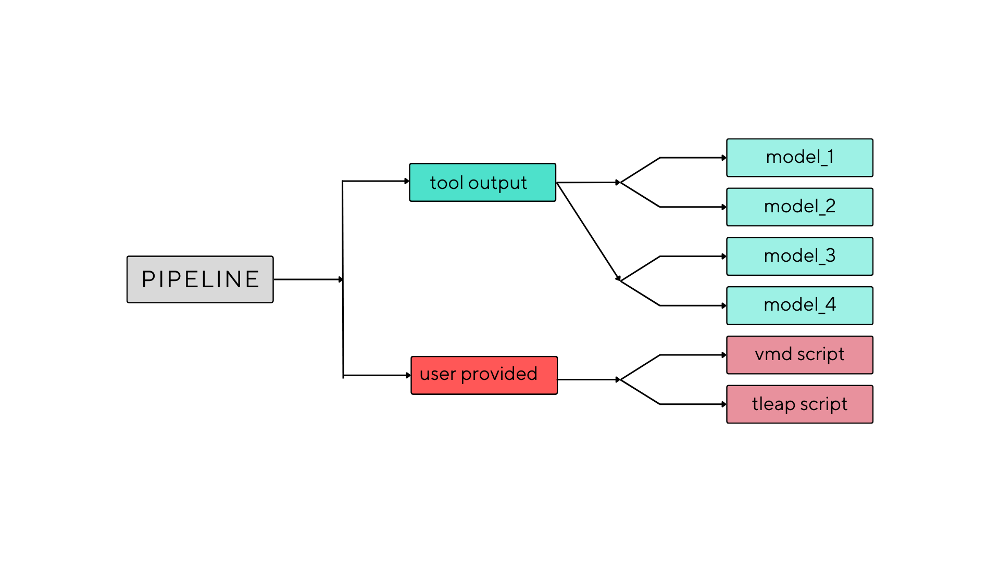

# Bioinformatics-tools

## generate_md_systems
This is a short bash script which helps the automatization of your md_simulation systems.
In order for this to work for your project there are some dependencies to be installed first:
* VMD for the visualisation of models
* amber -tleap for the system preparation

The user will need to respect the project structure mentioned in the pipe_structure.txt
In this pipeline directory the user need to provide a tleap script with 2 variables set as default values that would be replace in the generation of the script for each system.
These variables are model and number.
## Pipeline 

## Usage 
	generate_md_systems.sh  /path/to/root/directory
	 

